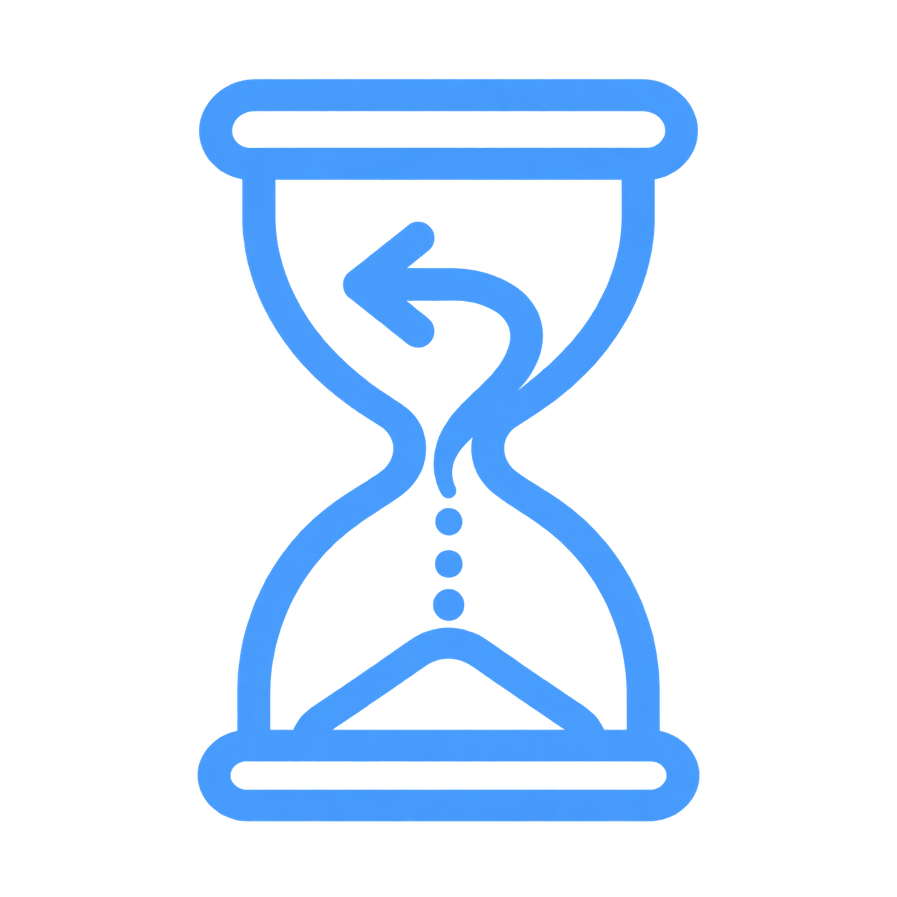

<p align="center">
  
</p>

<h1 align="center">Chronos</h1>

<p align="center">
  <strong>Serverside tick recorder and scrubber for Garry's Mod</strong><br>
  <sub>SendTable reflection · delta snapshots · voice replay</sub>
</p>

<p align="center">
  <a href="https://github.com/ds-kimi/Chronos/releases"></a>
  <a href="https://github.com/ds-kimi/Chronos"></a>
  <a href="LICENSE"></a>
  
  
</p>

<br>

A binary module snapshots every networked entity every tick, and a Lua addon replays the ring back through a slider. Nothing is listed by hand: the capture plan for a class is derived from the server's own `SendTable`, so any entity type, stock or addon or gamemode, is recorded without a single line of per-entity code.

## Demo Video

[](https://youtu.be/IxHQ3izP49U)

---

## Contents

- [Demo Video](#demo-video)
- [How it captures everything without per-class code](#how-it-captures-everything-without-per-class-code)
- [Install](#install)
- [Build](#build)
- [Usage](#usage)
- [What the addon does on top of the ring](#what-the-addon-does-on-top-of-the-ring)
- [Experimental mode](#experimental-mode-private-review)
  - [Stand-ins and the engine](#stand-ins-and-the-engine)
- [An edict index is not an identity](#an-edict-index-is-not-an-identity)
- [Voice replay](#voice-replay)
- [Configuration](#configuration)
- [Benchmark](#benchmark)
- [Lua API](#lua-api)
- [Tick numbering](#tick-numbering)
- [What is recorded](#what-is-recorded)
- [Known limits](#known-limits)
- [Contributing](#contributing)
- [License](#license)

---

## How it captures everything without per-class code

At load the module walks every `ServerClass`'s `SendTable` and flattens it into a
list of raw `{offset, size}` ranges inside the entity. That list is the capture
plan for that class.

Sub-tables are only followed when they are stored inline. A datatable proxy is
classified once, by calling it with a real entity and checking whether it hands
back the address it was given: inline tables do, tables that redirect to another
object do not. The call is made under a structured exception handler and the
verdict is cached per proxy, so an exotic proxy costs one guarded call and is
then skipped forever.

This is what pulls in the per-recipient exclusive tables, `DT_LocalPlayerExclusive`,
`DT_LocalWeaponData` and friends. They are stored inline but are not sent to
every client, so a flag-based test misses them and their contents (eye angles,
view offset, clip counts) would silently never be recorded.

Frames are delta-encoded against the previous capture of each edict, and every
entity is force-keyed once per `keyinterval` ticks, staggered by edict index.
A static world therefore costs almost nothing per tick, and any window of
`keyinterval` frames is independently seekable.

Snapshots live in a byte ring capped at 512 MB by default; the oldest frames are
dropped once the cap is hit.

## Install

Grab `chronos-win32.zip` from the [releases](https://github.com/ds-kimi/Chronos/releases)
and extract it over `garrysmod/`. It lands as:

```
garrysmod/addons/chronos/lua/    the addon
garrysmod/lua/bin/               gmsv_chronos_win32.dll
```

Win32 only: the module is built for 32-bit srcds, which is what Garry's Mod
dedicated servers run.

> **Set `voicehost`.** For voice to work, `addon/lua/chronos/shared/config.lua`
> (or `chronos voicehost <ip>`) needs your own IP: LAN/private IP for local
> testing, or your public IP with `voiceport` forwarded for a public server.
> See [Voice replay](#voice-replay).

### Voice is optional and needs Auris

Voice replay is captured through [Auris](https://github.com/ds-kimi/auris), which
is a separate binary module and addon. Install both if you want to hear what was
said during a recording.

Without Auris, Chronos works normally in every other respect: entities, effects
and sounds all record and replay. There is simply no voice, and
`chronos voicechain` reports `auris module: MISSING` rather than failing.

## Build

```
premake5 --gmcommon=garrysmod_common vs2019
msbuild projects/windows/vs2019/chronos.sln /p:Configuration=Release /p:Platform=Win32
```

Copy `projects/windows/vs2019/x86/Release/gmsv_chronos_win32.dll` into
`garrysmod/lua/bin/`, and `addon/lua` into an addon or into `garrysmod/lua`.
`deploy.sh` does both against a local srcds install.

## Usage

```
chronos record      start recording (leaves a scrub if one is open)
chronos stop        stop recording and freeze the world at the newest tick
chronos replay      freeze the whole server and enter scrub mode
chronos review      EXPERIMENTAL: watch it back privately, nobody else affected
chronos leave       return to the game
chronos stoponly    stop recording without freezing anybody (experimental mode)
chronos play        resume playback from the cursor
chronos pause       hold the cursor
chronos seek <tick> jump to a tick
chronos speed <n>   ticks advanced per server tick (0.05 - 8)
chronos spectate 1  unfreeze yourself and fly around instead of being replayed
chronos ghosts 0    disable respawning deleted entities and hiding future ones
chronos viewlock 1  force replayed players' own cameras (off by default)
chronos memcap <mb> ring size
chronos keyinterval <ticks>  keyframe stagger, also the seek window
chronos exit        leave scrub mode and unfreeze
chronos clear       drop the recording
chronos stats       frames, memory, tick range
chronos bench run [rounds] [seconds] [deep]  profile the server under load
chronos bench now | on [deep] | off | reset | stop
chronos help        list commands
chronos_ui          open the panel, then toggle its mouse capture (client)
chronos_ui_close    close the panel (client)
```

Commands are admin-only by default; `chronos_adminonly 0` opens them up.

Bind `chronos_ui` to a key. The first press opens the panel; every press after
that toggles between grabbing the mouse and handing it back to the game. The
panel stays on screen either way, so a scrub can be watched while flying, and it
never takes keyboard focus, so movement and chat keep working.

Dragging the timeline pauses and scrubs; releasing it resumes playback. When the
panel is closed, a HUD strip shows record and playback state instead.

## What the addon does on top of the ring

`chronos stop` does not hand the world back. It freezes at the newest recorded
tick and stays there until `chronos exit`, so nothing drifts before it can be
reviewed. Physics motion is disabled, players are frozen, and every entity is
re-pinned to the cursor on every tick. This is the mode everything else here was
built around, and it is what the panel drives.

[Experimental mode](#experimental-mode-private-review) is the alternative: the same review with
nobody else frozen. It is boxed off and labelled in the panel because it is
newer and rougher, and the two cannot both hold the world — entering the
server-wide replay closes any private review that is open.

Frozen players have their usercmds cleared in a shared `StartCommand` hook, so
the client stops predicting movement at the same instant the server stops it,
and are re-pinned to `MOVETYPE_NONE` with zero velocity right after each restore.

Players are replayed onto their own bodies by default. `chronos spectate 1`
excludes you from restores, unfreezes you, and gives you noclip so you can fly
through the frozen scene. Your own recorded body then follows the cursor as a
`prop_dynamic` stand-in, since `CBasePlayer` cannot be spawned as one.

While scrubbing, the addon diffs the recorded manifest for the current tick
against the live world every 16 ticks (and after every jump):

- entities that no longer exist are respawned as ghosts and bound with
  `chronos.BindProxy`, so the module drives them like the originals
- entities that did not exist yet at that tick are hidden and made non-solid
- both are undone on `chronos exit`

Ghosting is limited to classes that spawn correctly from a class name plus a
model (`prop_physics`, `prop_dynamic`, `prop_ragdoll`, and variants) and capped
at 256 stand-ins.

## Experimental mode: private review

> **The server can and probably will crash.** This is much newer than everything
> around it. It is a second mode in the panel, behind a red box, and it should
> not be pointed at a server anybody cares about.

`chronos replay` pins the whole server to a tick: everybody is frozen so one
admin can look at something. `chronos review` does the same review without
stopping anybody, which is what reviewing an incident actually needs.

Nothing in the live world is written to. The recording keeps running underneath,
and the replay is built out of stand-ins spawned next to the live world:

- props come back as their own class, bound with `chronos.BindProxy`, so the
  module replays their full recorded state. Everything else, players and NPCs
  and anything with custom spawn logic, is a `prop_dynamic` puppet posed from
  the rebuilt tick: spawning a live NPC or weapon would run its AI and its
  pickup logic inside a world people are still playing in
- no stand-in keeps a physics object, and the restore never writes the props the
  engine owns structurally into one (see [stand-ins](#stand-ins-and-the-engine))
- entities that are parented rather than placed, carried weapons and viewmodel
  arms above all, are skipped. Their recorded origin is the parent-relative
  zero, so puppeting them piles models on the map origin until the edict pool
  runs dry
- stand-ins are created once and kept for the whole session, hidden on the ticks
  their original did not exist. Removing and respawning them on every manifest
  change is what took the server down on a timeline drag: Source does not hand
  an edict back the moment it is freed
- stand-ins are transmitted to viewers only, and the whole live entity
  population is transmitted to everybody but viewers, with `SetPreventTransmit`
  on both sides. Map geometry is left alone, so a viewer stands in the same
  level rather than an empty skybox
- the viewer's own body is hidden from everybody else and given noclip, and is
  put back where it started on exit
- effects go out through a single-recipient filter, sounds are played on the
  viewer's client rather than through the engine sound interface, and voice
  clips are sent only to viewers, so a firefight from ten minutes ago is silent
  to everybody else
- stand-ins are excluded from capture with `chronos.SetSkip`, or the recording
  would file the replay back into itself

Viewers share one cursor: several admins can watch, but they watch the same
scrub. The scrubber panel and every playback command work unchanged, and the
mode line is sent per client, so a viewer sees `replay` while the rest of the
server still sees `recording`.

Ragdoll bone poses, health and bodygroups are not carried onto puppets, only
model, position, angles, sequence, cycle and skin.

### Stand-ins and the engine

A stand-in is not the entity it replays, and that difference used to crash the
server: a burst of them died inside `prop_physics` `Spawn` with no dump, at an
allocation site rather than on any particular model.

Two things caused it, and both are fixed:

- **A stand-in kept a live physics object.** It is now destroyed outright at
  spawn rather than frozen, and the entity is made `SOLID_NONE` with
  `MOVETYPE_NONE`. Nothing about a stand-in needs to simulate; the module writes
  its position every tick.
- **The restore wrote the whole blob onto it.** Some SendProps resolve to
  offsets past the end of the object they describe: custom proxies park them
  there, and the plan keeps anything under `kMaxPropOffset`. Reading them during
  capture is harmless, and writing them back onto the entity they came from
  mostly is too, since the bytes go back where they were found. Writing them
  onto a stand-in puts one object's trailing memory into another's, which
  corrupts whatever the allocator has after it — and the crash then lands in the
  next spawn rather than at the write.

  A stand-in is therefore written **by name**, not wholesale: origin, angles,
  sequence, cycle, playback rate, model scale, skin, body, hitbox set, render
  mode/fx/colour, health and lifestate. Everything else stays on the entity that
  owns it. This applies **only when the target is a stand-in**; a restore onto
  the original entity still writes everything.

  Blacklisting the structural props (`m_nModelIndex`, the collision property,
  `m_MoveType`, `m_CollisionGroup`, the parent and owner handles) was tried
  first and did not stop the crash, which is what pointed at the out-of-range
  offsets rather than at the engine's own bookkeeping.

`chronos replay` builds its ghosts through the same path, so both modes carry
the fix. `chronos_stageclones 0` falls back to puppeting props as well, which
needs neither.

| Convar | Default | Purpose |
| --- | --- | --- |
| `chronos_stageclones` | `1` | Recreate props as their own class instead of puppets |
| `chronos_stagespawn` | `1` | Spawn stand-ins at all; `0` opens a stage that only hides the live world |
| `chronos_stagedebug` | `0` | Log every stand-in as it is created |

## An edict index is not an identity

The recording keys everything by edict index, and for a while the replay treated
that index as if it named an entity. Source does not: it parks a freed edict
briefly and then hands the same index to the next spawn. So a session that goes
*spawn a prop, delete it, spawn another* ends with two different entities that
were both, at different times, "index 292".

Every symptom below came from that one assumption:

- **A deleted prop never came back.** Its ghost was refused because the live
  entity sitting at its index looked like a match — same class, and with the
  same prop spawned twice, the same model too.
- **The new prop was hidden and could not be moved.** It was not in the recorded
  manifest under its own name, so the visibility pass hid it, and the ghost
  bound to its index drew the dead prop over the top of it. The new prop was
  underneath, `NODRAW` and not solid.
- **The new prop took on the old one's appearance.** A restore onto what it
  believed was the original writes the whole blob, so the live prop was fed a
  dead prop's state every tick.
- **Undo or Delete on it took the server down.** That whole-blob write is the
  same hazard as writing onto a stand-in: SendProps that resolve past the end of
  the object put one entity's trailing memory into another's, and the crash
  lands later, at the next allocation, not at the write.

Experimental mode was immune to all of it and stayed the reference: it never
writes into anything but its own clones, so a slot changing hands cost it
nothing.

The fix is that identity is the pair **(index, birth tick)**, never the index
alone:

- The recorder stamps `born` on a slot the tick it goes from empty to live, and
  ships it in **every keyframe**. Inferring it during the rebuild instead was
  tried and does not work: a seek window only reaches back a couple of key
  intervals, so an entity spawned earlier than that has no visible birth.
- Every live entity is stamped with the tick it was created on, scoped to a
  recording session so stamps from an earlier recording cannot pass as current.
  Whatever is already standing when recording starts is stamped `-1`, and the
  recorded side uses `-1` for the same, so the map's own entities match without
  a birth tick ever being captured.
- A live entity is written into only when both birth ticks agree (within two
  ticks, since a spawn lands between two captures) on top of class and model.
- A ghost remembers which occupant it stands for and is released the moment its
  index changes hands, or hands back to a live original.
- An index that is neither ghosted nor proven original is muted for the restore
  rather than written to, so nothing lands on a stranger.

## Voice replay

Chronos records player voice chat alongside the world and plays it back in sync
with the cursor, positioned on the speaker.

Voice needs [Auris](https://github.com/ds-kimi/auris) installed alongside
Chronos, module and addon both. Without it everything else still records and
replays; there is just no voice.

Audio comes from Auris through its
`Auris_VoiceEnd` hook, which fires the moment a player stops speaking and before
any transcription work begins, so there is no whisper latency to compensate for
and no GPU cost. Chronos consumes the utterance, since it wants the recording
rather than the text. It also asks Auris to preserve silence in the captured
audio: transcription drops pauses, which would make every clip shorter than the
stretch of time it covers.

Audio only arrives once speech ends, so a clip cannot be filed against the frame
it was flushed on. The frame each speaker started on is sampled from the rising
edge of `Player:IsSpeaking()` during recording, and the clip is filed there. A
mark that would make the clip longer than the wall clock it spans is rejected,
and the filing frame falls back to counting backwards from the flush.

Finished WAV bytes are handed to the module, which serves them over a small
HTTP server on a configurable port. Clips are addressed only by an opaque id
(`/clip/<id>`), so nothing a client sends ever reaches the disk, and the ring is
evicted oldest first once `voicecap` is exceeded.

Entering a scrub sends clients a manifest of every clip in the recording, which
they fetch and park paused at zero. Playback is then instant, and channels are
resynced against the replay cursor rather than left to run on their own clock,
so pause holds mid-sentence and resume picks up where the world did.

Because the clip URL is what clients fetch from, `voicehost` has to be an address
they can actually reach: a LAN address works only for LAN players, and a public
server needs its public address with the port forwarded.

```
chronos voiceport <port>  start the clip server (0 stops it and disables capture)
chronos voicehost <ip>    address clients fetch clips from
chronos voicecap <mb>     clip budget, evicted oldest first
chronos voicestats        server state, clip count, hook status, URL
chronos voicetest         file and emit a 440 Hz test clip
chronos voicedebug <0|1>  log every capture and why any were dropped
chronos voicechain        trace the whole Auris to chronos to client chain
```

`voiceport` and `voicehost` persist as archived convars, so a value set in game
survives a restart.

## Configuration

`addon/lua/chronos/shared/config.lua` holds the defaults applied on load.
Anything there can still be changed at runtime with the matching command, and
the saved convar wins over the file, so a value changed in game is not reverted
on the next map load.

| Key | Default | Purpose |
| --- | --- | --- |
| `voicehost` | `192.168.1.53` | Address clients fetch voice clips from |
| `voiceport` | `27020` | Clip server port; 0 disables voice capture |
| `voicedebug` | `true` | Log every voice capture and drop |
| `memcap` | `512` | Snapshot ring size in MB |
| `keyinterval` | `64` | Keyframe stagger, and the seek window |
| `voicecap` | `256` | Voice clip budget in MB |

## Benchmark

Chronos does its work in C++, inside the server frame, across all 8192 edict
slots every tick. A `SysTime()` wrapper in Lua cannot measure that: it cannot
split scrape from emit from plan lookup, it cannot probe per entity without the
probe costing more than the work, it cannot see process memory or CPU time, and
it cannot tell engine work apart from the sleep srcds does to hold tickrate.

So the instrumentation lives in the module and Lua only drives the schedule.
`chronos bench` runs the server against a rising load ladder and writes a plain
text report to `garrysmod/data/chronos_bench/`.

### Quick start

```
chronos bench run 3 20
```

Three rounds, twenty seconds of recording each. Round 1 measures the map alone,
round 2 adds ten active bots and a hundred props, round 3 adds ten more of each.
A run takes roughly `rounds * (warmup + baseline + seconds + seek)` seconds and
prints every block to the server console as it goes, so a run that kills the
server still leaves its evidence behind.

### Commands

```
chronos bench run [rounds] [seconds] [deep]  scheduled load ladder
chronos bench stop                           end the run early and write the report
chronos bench now                            print the current window immediately
chronos bench on [deep]                      instrumentation without a schedule
chronos bench off                            stop measuring, remove the frame hook
chronos bench reset                          restart the measurement window
```

`chronos bench on` followed by `chronos bench now` is the immediate mode: it
measures whatever the server happens to be doing, with real players on it, and
prints a block on demand. `chronos bench run` is the controlled mode.

### What one round does

| Phase | Default | What it is for |
| --- | --- | --- |
| warmup | 4 s | Lets the bots and props just added settle |
| baseline | 6 s | **Instrumentation on, recording off.** The control |
| record | 20 s | `chronos record`, the full capture path under load |
| seek | 50 seeks | `BuildStateAtTick` and `RestoreTick`, spread over driver steps |

The baseline is the point of the whole design. It is the same server, the same
load and the same clock with Chronos not capturing, so the recording rows are a
subtraction rather than a guess. Seeks are spread over several driver steps
rather than fired in one burst, because fifty back to back is a freeze the
tickrate sample would then have to be explained around.

Between rounds the ring is cleared, ten bots are added and another batch of
props is spawned. Bots move, sweep their aim, jump and fire, so delta volume,
sounds and temp entities scale with them; idle bodies would only scale the edict
count.

### Reading the report

```
== ROUND 2 RECORDING  bots 10  props 100  players 10 ==
clock      rdtsc 3.593 GHz  probe 8.9 ns  qpc 10.000 MHz  deep on
phase                    n      mean      p50      p95      p99       max      total  %frame
gameframe.total        528     4.919    3.164    7.158   44.367   167.487     2597.3   100.0
gameframe.gap          527    14.876   15.507   28.146   44.477    62.940     7839.8       -
capture.tick           528     1.532    1.345    2.362    4.165    10.946      808.8    31.1
  capture.scrape       528     0.770    0.660    1.260    1.972     5.721      406.5    15.6
  capture.emit         528     0.453    0.408    0.656    1.005     6.433      239.1     9.2
  capture.plan         528     0.115    0.100    0.164    0.266     1.583       60.6     2.3
tempent.hook           149     0.003    0.002    0.008    0.012     0.018        0.4     0.0
lua.tick               528     0.110    0.051    0.117    0.211    26.425       58.0     2.2
budget     32.5% of the 15.15 ms tick   over-budget ticks 18 of last 528   worst 167.487 ms
tickrate   actual 67.22 tps   1%-low 22.48 tps   jitter 8.600 ms   longest gap 62.940 ms
memory     ring 8.6 MB / 512 MB (528 frames, 16.6 KB/tick, p99 23.3 KB)  pool 0
           process WS 222 MB (+13 MB since reset)  private 855 MB  peak 223 MB  threads 31
           system 4.4 GB free of 15.9 GB
cpu        user 3.31 s  kernel 1.28 s  over 8.0 s -> 57.4% of one core
capture    scanned 8192/tick  live 408.0  key 7.1/tick  delta 400.9/tick  gone 0.0/tick
           emitted 16.6 KB/tick of 698.5 KB scanned (2.4% of blob)
```

| Row | Meaning |
| --- | --- |
| `gameframe.total` | The whole engine server frame, **work only**, from a detour on `IServerGameDLL::GameFrame`. This is the denominator for `%frame` |
| `gameframe.gap` | Wall time between frames, which is where real tickrate comes from. It has no `%frame` share by definition, so it prints `-` |
| `capture.tick` | `CaptureTick`: the 8192-slot scan, the delta encode and the frame push |
| `capture.scrape` / `emit` / `plan` | Deep mode only. Summed in cycles across the whole loop and converted once per tick, so the conversion is not paid per entity |
| `restore.tick` | The push loop of `RestoreTick`, with the rebuild below it timed separately |
| `rebuild.seek` | `BuildStateAtTick`: replaying `keyinterval * 2` frames over all work slots |
| `tempent.hook` | Only the scrape inside the `PlaybackTempEntity` hook; the engine call it wraps is not charged here |
| `lua.tick` | The Lua `Tick` body **minus** the native time inside it, so nothing is counted twice |

`budget` is mean frame against the tick interval, which is the direct answer to
how much tickspeed is being eaten. `over-budget ticks` counts frames in the last
window that ran longer than one whole tick.

The `emitted ... of ... scanned` line is the delta ratio, and it is what decides
how long the ring lasts. 2.4% here means almost nothing is moving and 512 MB
holds a long recording; a busy server pushes that up and the ring drains faster.

`pool 0` means the buffer recycler has not been touched yet, which is expected
until the ring hits its cap for the first time.

### The scaling matrix

Every run ends with one row per round, which is the table worth keeping:

```
== SCALING ==
 bots  props    live  capture.tick   %frame     MB/s       tps    ws MB
    0     50     178       0.697ms     28.7     0.43     67.13      194
   10    100     408       1.532ms     31.1     1.09     67.22      222
```

Live entity count, not player count, is what capture cost tracks.

### Deep mode

`chronos bench run 3 20 deep`, or `chronos bench on deep`, turns on the
per-entity probes behind the `capture.scrape` / `emit` / `plan` breakdown. They
use `rdtsc` rather than `QueryPerformanceCounter`, because at 8192 edicts a tick
QPC's call cost is larger than the work being measured. The cycle rate is pinned
against QPC when instrumentation is enabled, and the `clock` line reports both
that rate and the measured cost of a probe pair, so the numbers state their own
error bar.

Deep mode costs real budget. Run the same round with and without it and compare
`gameframe.total`: that difference is the instrumentation overhead. Leave it off
for anything measuring absolute cost, turn it on when chasing which half of the
capture path got slower.

### Tuning a run

Everything lives in `CHRONOS.Bench` and can be set from a server script before
`chronos bench run`:

| Field | Default | Purpose |
| --- | --- | --- |
| `Rounds` | `3` | Rungs on the ladder |
| `Warmup` | `4` | Seconds to let new load settle |
| `Baseline` | `6` | Seconds of recording-off control |
| `Record` | `20` | Seconds of recording per round |
| `Seeks` | `50` | Seeks in the seek phase |
| `SeeksPerStep` | `10` | Seeks per driver step, to spread the cost |
| `BotsPerRound` | `10` | Bots added between rounds |
| `PropsPerRound` | `100` | Props added between rounds |
| `MinTpsFraction` | `0.6` | Abort below this fraction of target tickrate |
| `MaxWorkingSetMB` | `3072` | Abort past this working set |

Both abort guards are recorded rather than applied silently: a run that trips one
names it in an `ABORTED:` line at the end of the report.

### Things to know before trusting a run

- **The seek phase rewinds the live world.** It calls `chronos.Restore` for
  real, which is the only way to measure what a restore actually costs. Humans
  on the server are put on the ignore list for the duration so they keep control
  of themselves, but props and bots do get thrown around. Benchmark on a server
  nobody is playing on.
- **Bots need slots.** `RunConsoleCommand("bot")` silently does nothing once
  `maxplayers` is reached, so the ladder quietly stops growing. The `bots` column
  is counted after the warmup, so it reports what actually connected rather than
  what was asked for.
- **Hibernation is disabled for the duration.** An empty srcds stops thinking and
  round 1 has no players, so `sv_hibernate_think` is set to `1` while a run is in
  flight and back to `0` when it ends.
- **The frame hook only exists while measuring.** `chronos bench off` removes it,
  and so does module unload. An idle server carries no patched vtable entry it
  did not ask for.
- **`gameframe` maxima include map churn.** Prop spawns, the seek bursts and the
  engine's own periodic work all land in `max`. Read `p50` and `p95` for the
  steady state and `max` for what the worst tick looked like.

## Lua API

| Function | Purpose |
| --- | --- |
| `chronos.Start() / Stop() / Clear()` | recording session control |
| `chronos.IsRecording()` | bool |
| `chronos.Capture(curtime)` | capture the current tick, once per tick |
| `chronos.Restore(tick, proxyOnly)` | rebuild and push world state at `tick`; `proxyOnly` writes to bound stand-ins only |
| `chronos.GetRange()` | `firstTick, lastTick, frameCount` |
| `chronos.GetEntities(tick)` | `{ [edictIndex] = { class, model } }` |
| `chronos.GetStats()` | bytes, cap, frames, keyinterval, recording |
| `chronos.SetMemoryCap(mb)` | ring size |
| `chronos.SetKeyInterval(ticks)` | keyframe stagger, also the seek window |
| `chronos.SetIgnore(index, bool)` | never restore this edict |
| `chronos.ClearIgnore()` | clear all ignores |
| `chronos.SetSkip(index, bool)` | never capture this edict |
| `chronos.ClearSkip()` | clear all capture skips |
| `chronos.BindProxy(recorded, live)` | replay a recorded edict onto a different live one; a negative `live` drops the binding |
| `chronos.ClearProxies()` | drop all proxy bindings |
| `chronos.GetTransform(index)` | position and angles at the tick last built |
| `chronos.ReadProp(index, name)` | read one named prop out of the rebuilt state |
| `chronos.PlayEffects(from, to, ply)` | re-broadcast temp entities recorded in that range, to one player index if given |
| `chronos.ClearEffects()` / `chronos.EffectCount()` | effect ring control |
| `chronos.GetPlan(index)` | resolved prop names for that entity's class |
| `chronos.StartClipServer(port)` / `chronos.StopClipServer()` | voice clip HTTP server |
| `chronos.AddClip(wavBytes)` | store a clip, returns the id its URL is built from |
| `chronos.ClearClips()` / `chronos.SetClipCap(mb)` / `chronos.ClipStats()` | clip ring control |
| `chronos.BenchEnable(on, deep)` | instrumentation and the `GameFrame` detour on or off |
| `chronos.BenchReset()` | zero every sample and restamp the CPU and memory baseline |
| `chronos.BenchMark(phase, ms)` | file a Lua-measured span into a named phase, e.g. `lua.tick` |
| `chronos.BenchSample()` | live numbers for guards and HUDs: frame mean and p99, capture mean, tps, live count, frame bytes |
| `chronos.BenchReport(label, tickMs)` | the rendered text block for one window |
| `chronos.ProcStats()` | working set, private and peak bytes, process CPU time, thread count, system RAM |

## Tick numbering

Ticks are counted by the module itself, starting at 0 on `chronos record`. They
are not engine tick numbers: `CGlobalVars` does not have the same field layout in
this SDK as in the shipped engine, so `tickcount` read the wrong member. `curtime`
is whatever Lua passes to `chronos.Capture`.

## What is recorded

Four tracks, all feature-agnostic.

**State**, every SendProp of every entity with an edict, every tick. Nothing is
listed by hand, so this covers props spawning, moving and breaking, weapon clips
and fire timers, player health, position and aim pose, NPC state, doors,
ragdoll bone arrays, models, skins, bodygroups and parenting. Any addon entity
is included the moment it exists, because its class is read from the server's
own SendTable.

**Aim**, a flat `{index, pitch, yaw}` row per player per tick, recorded in Lua.
A player's own view angles are client-authoritative, so restoring the networked
prop is not enough; the server pushes the angle back with `SetEyeAngles`, and
only when it has actually drifted, since a redundant fixangle reads as jitter.

**Effects**, every temp entity, captured at the single choke point the engine
routes them all through: `IVEngineServer::PlaybackTempEntity`. Its vtable slot is
resolved with `Detouring::GetVirtualAddress` rather than a counted index, and the
hook flattens the sender's SendTable with the same machinery entities use, so an
effect type is described once and captured forever after.

That covers blood, decals, tracers, muzzle flashes, sparks, explosions, gibs,
`util.Effect` dispatches and every addon effect, without naming any of them.
Replay writes the captured bytes back into the original sender, which is a
long-lived singleton in the server binary, and asks the engine to broadcast it
again through a recipient filter the module supplies itself.

**Sounds**, the one event class outside that path, since they travel through the
engine sound interface. A single `EntityEmitSound` hook catches all of them,
engine or Lua.

Effects and sounds are keyed by frame number and re-fired when playback crosses
their frame. Both are skipped while scrubbing, since dragging across a firefight
would dump every gunshot at once. Voice is the exception: a clip is one discrete
utterance, so it plays on any jump rather than only on continuous playback.
Bullet damage is never re-run: only the visual half is replayed, so the state
being restored stays authoritative.

## Known limits

- Only entities with an edict are recorded; entities without one are invisible
  to clients anyway.
- Restores write members and dirty the edict, so clients see the rewind, but the
  engine's spatial partition is not relinked. Traces and hitboxes on the server
  still reflect live positions, not replayed ones.
- Entities deleted after recording only come back if their class is ghostable.
  Anything with custom keyvalues stays missing.
- Players are not ghosted: `CBasePlayer` cannot be spawned as a stand-in. They
  are replayed onto their own bodies, so a player who left is not shown.
- String and `DPT_GMODTable` props are not captured, so networked names and GMod
  tables do not replay.
- Some SendProps resolve to offsets past the end of the object they describe.
  Custom proxies park them there, and the plan keeps anything under
  `kMaxPropOffset`, so capture reads a few bytes of whatever the allocator put
  after the entity. Restoring writes them back where they were found, which is
  why nothing has been seen to break: the bytes return to the same address they
  came from. It is still a write outside the object, and if anything else has
  claimed or changed that memory between capture and restore, a replay puts
  stale bytes over it. Stand-ins are already immune, since they are restored by
  name (see [stand-ins](#stand-ins-and-the-engine)); a restore onto the original
  entity is not. The fix is bounding plan offsets to the real class size when
  the SendTable is flattened, which the SendTable does not carry.
- `CUtlVector`-backed props are deliberately skipped. Their elements live on the
  heap, so the SendProp offsets address the vector header and its data pointer;
  restoring those bytes puts a stale pointer into a live entity. `m_AnimOverlay`
  is the one that bites, and the engine reports it as "Gesture slot pointing to
  wrong address".
- Net messages and usermessages are not recorded. Anything an addon draws from
  its own netcode (custom HUDs, notifications) will not reproduce.
- Props flagged `SPROP_ENCODED_AGAINST_TICKCOUNT` (`m_flSimulationTime`,
  `m_flAnimTime`) are deliberately skipped. They are encoded relative to the
  current tick, so replaying old values makes clients interpolate against
  timestamps from the past.
- The clip server is Windows-only (Winsock) and serves plain HTTP, one
  connection at a time.
- Voice replay needs Auris loaded. Without it, everything else still records.

## Contributing

See [CONTRIBUTING.md](CONTRIBUTING.md).

## License

[CC BY-NC-SA 4.0](LICENSE). Free to use, modify and share for non-commercial
purposes, with attribution, and derivatives shared under the same terms.

---

## Star history

<a href="https://www.star-history.com/#ds-kimi/Chronos&amp;Date"></a>

See the interactive chart on **[Star History](https://www.star-history.com/)** (repo: `ds-kimi/Chronos`).
